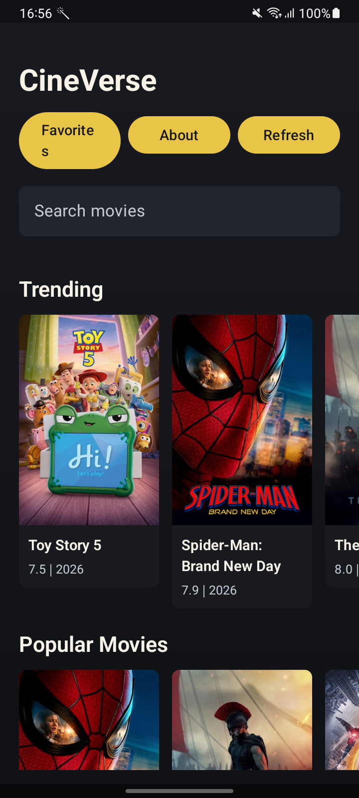
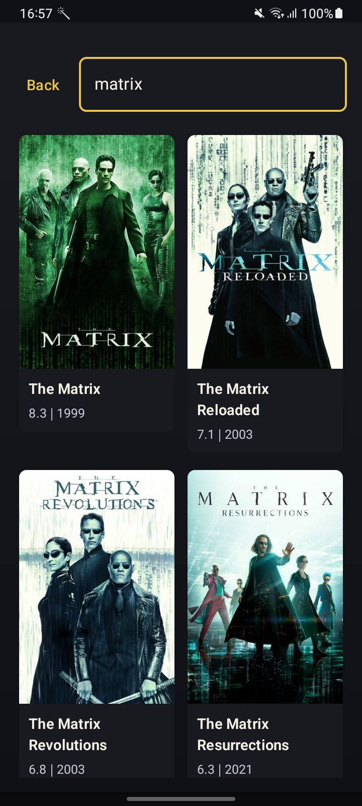
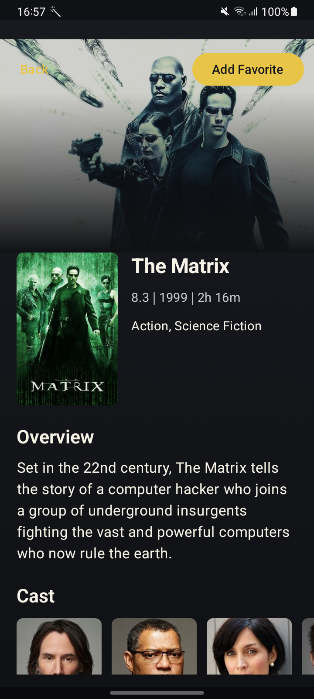
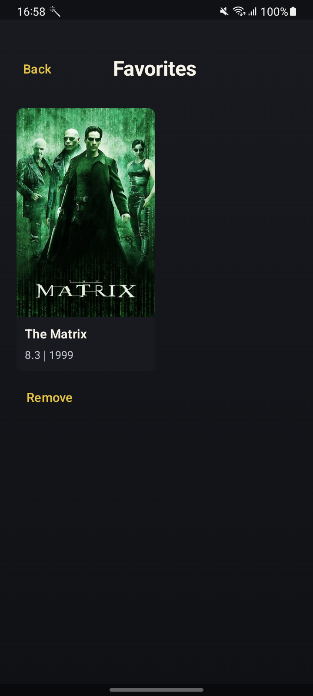
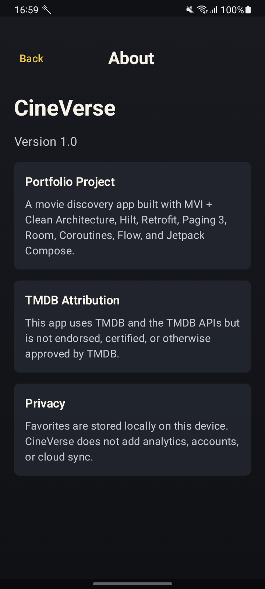

# CineVerse

CineVerse is an Android movie discovery portfolio app built with MVI, Clean Architecture, Jetpack Compose, Hilt, Retrofit, Paging 3, Room, Coroutines, and Flow.

The app uses TMDB for movie data and images, and stores favorites locally with Room.

## Features

- Home discovery rows: Trending, Popular Movies, Now Playing, and Top Rated
- Search movies with debounce, `distinctUntilChanged`, `flatMapLatest`, and Paging 3
- Movie details with backdrop, poster, metadata, runtime, genres, overview, cast, similar movies, and recommendations
- Local Favorites backed by Room and exposed through Flow
- Favorite status on the details screen with add/remove support
- About/Profile screen with app version, architecture summary, privacy note, and TMDB attribution
- Loading, empty, retry, and error states across the main flows
- Dark and light theme support through Material 3 color schemes

## Screenshots

Screenshots were captured from the Android app running on a connected device.

| Home | Search | Details |
| --- | --- | --- |
|  |  |  |

| Favorites | About |
| --- | --- |
|  |  |

## Architecture

```text
Compose UI
  -> MVI ViewModel
  -> UseCase
  -> Repository interface
  -> Repository implementation
  -> Remote TMDB API / Local Room database
```

Main package layout:

- `domain`: domain models, repository contract, and use cases
- `data.remote`: Retrofit API, DTOs, paging source, and DTO mappers
- `data.local`: Room database, DAO, entity, local data source, and entity mappers
- `data.repository`: repository implementation that coordinates remote and local data
- `presentation`: MVI contracts, ViewModels, and Compose screens
- `di`: Hilt modules for network, repository, and database bindings
- `core`: shared infrastructure such as TMDB image URL helpers

## Tech Stack

- Kotlin
- Jetpack Compose + Material 3
- MVI + Clean Architecture
- Hilt
- Retrofit + OkHttp
- Paging 3
- Room 3
- Coroutines + Flow
- Coil
- JUnit, MockK, coroutine test utilities, AndroidX test

## TMDB API Setup

Never commit a real TMDB token.

1. Create a TMDB API Read Access Token in your TMDB account settings.
2. Copy `local.properties.example` to `local.properties`, or edit your existing `local.properties`.
3. Add:

```properties
TMDB_ACCESS_TOKEN=your_tmdb_read_access_token_here
```

This project also supports `secret.properties` with environment-specific keys:

```properties
dev.TMDB_ACCESS_TOKEN="your_debug_token"
prod.TMDB_ACCESS_TOKEN="your_release_token"
```

The app reads the value into `BuildConfig.TMDB_ACCESS_TOKEN` at build time and sends it as a Bearer token through the existing OkHttp interceptor.

## Build And Run

```bash
./gradlew :app:assembleDebug
```

Open the project in Android Studio, sync Gradle, select an emulator/device, and run the `app` configuration.

For this Windows workspace, Gradle was verified with:

```powershell
$env:GRADLE_USER_HOME = Join-Path (Get-Location) '.gradle'
$env:ANDROID_USER_HOME = Join-Path (Get-Location) '.android'
./gradlew :app:testDebugUnitTest --no-configuration-cache --no-daemon --max-workers=1 --console=plain "-Dorg.gradle.jvmargs=-Xmx1280m -XX:TieredStopAtLevel=1 -Dfile.encoding=UTF-8" "-Dkotlin.compiler.execution.strategy=in-process"
```

## Testing

Run unit tests:

```bash
./gradlew :app:testDebugUnitTest
```

Compile Android tests:

```bash
./gradlew :app:compileDebugAndroidTestKotlin
```

Run lint:

```bash
./gradlew :app:lintDebug
```

Build release:

```bash
./gradlew :app:assembleRelease
```

Covered areas include:

- Home ViewModel
- Search ViewModel and PagingSource
- Movie details mapper, repository, use case, and ViewModel
- Favorites use cases, repository behavior, entity mapping, and ViewModel
- Room DAO Android test source
- About ViewModel

## TMDB Attribution

This app uses TMDB and the TMDB APIs but is not endorsed, certified, or otherwise approved by TMDB.

TMDB attribution requirements are documented in the official TMDB API Terms of Use and FAQ:

- https://www.themoviedb.org/api-terms-of-use
- https://developer.themoviedb.org/docs/faq

## Release Notes

This project is portfolio-oriented and non-commercial. Before publishing a public repository, rotate any token that was ever committed locally and verify release signing if distributing outside a debug build.
